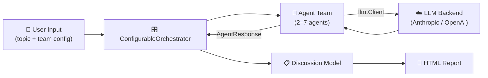
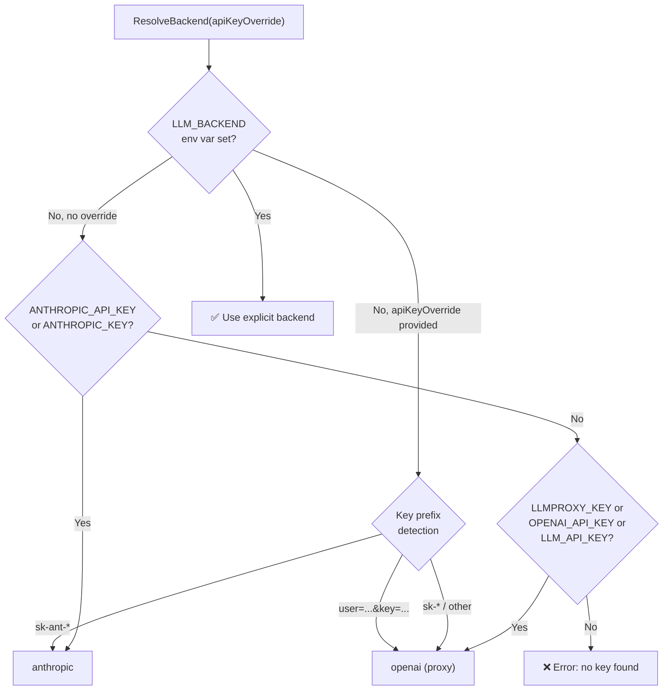
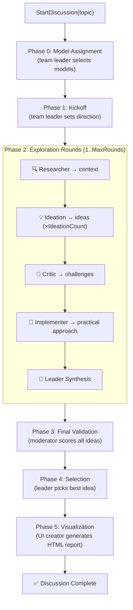
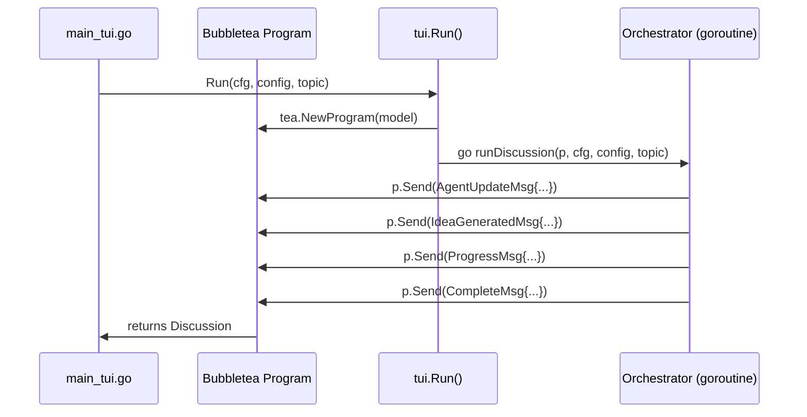

# IdeaArmy — Architecture Guide

## Overview

IdeaArmy is a multi-agent AI orchestration system written in Go. A user provides a topic, and a configurable team of AI agents collaboratively brainstorms, validates, and selects the best idea, then generates a rich HTML "idea sheet" report.



**Key design decisions:**

- All LLM interaction goes through the `llm.Client` interface — agents never import a backend package directly.
- Each agent can run on a **different LLM model**, assigned at runtime by the team leader.
- Agent failures during exploration rounds are logged but non-fatal; the discussion continues.
- The system ships three frontends: interactive TUI (Bubbletea), headless CLI, and an HTTP server with a War Room web UI.

---

## Directory Structure

```
idea-army/
├── cmd/
│   ├── cli/
│   │   ├── main.go          # v1 CLI (single orchestrator, 4 agents)
│   │   ├── main_v2.go       # v2 CLI (configurable team, headless)
│   │   └── main_tui.go      # TUI entry point (Bubbletea)
│   └── server/
│       ├── main.go           # v1 web server
│       └── main_v2.go        # v2 web server with War Room UI
├── internal/
│   ├── llm/
│   │   ├── interface.go      # Client interface + Message type
│   │   ├── tools.go          # ToolDefinition, ToolCall, StreamingClient, ToolCallingClient
│   │   ├── resolve.go        # BackendConfig + env-var auto-detection
│   │   ├── models.go         # ListModels() — model discovery
│   │   └── http.go           # Shared HTTP client with timeout
│   ├── llmfactory/
│   │   └── factory.go        # NewClient, NewClientAuto, NewClientWithModel
│   ├── claude/                # Anthropic Messages API implementation of llm.Client
│   ├── openai/                # OpenAI-compatible API implementation of llm.Client
│   ├── tools/
│   │   └── websearch.go      # Firecrawl web search tool (FIRECRAWL_API_KEY)
│   ├── agents/
│   │   ├── agent.go          # Agent interface, BaseAgent, BuildContext()
│   │   ├── team_leader.go    # Team Leader agent
│   │   ├── ideation.go       # Ideation agent (parses JSON ideas)
│   │   ├── moderator.go      # Moderator agent (scores ideas)
│   │   ├── researcher.go     # Researcher agent (web search via Firecrawl)
│   │   ├── critic.go         # Critic agent
│   │   ├── implementer.go    # Implementer agent
│   │   └── ui_creator.go     # UI Creator agent (HTML report generation)
│   ├── models/
│   │   ├── types.go          # Discussion, Message, Idea, AgentRole, AgentResponse
│   │   └── config.go         # TeamConfig + presets (Standard/Extended/Full)
│   ├── orchestrator/
│   │   ├── orchestrator.go   # v1 Orchestrator (fixed 4-agent team)
│   │   └── orchestrator_v2.go# ConfigurableOrchestrator (dynamic team, per-agent models)
│   └── tui/
│       ├── model.go          # Bubbletea Model, messages, Update/View
│       ├── runner.go         # Run() — bridges orchestrator ↔ TUI
│       └── styles.go         # Lipgloss styles and agent personas
├── Makefile                   # build, check, run-tui, run-cli, run-server
├── go.mod / go.sum
└── ARCHITECTURE.md            # ← you are here
```

---

## Core Abstractions

### `llm.Client` Interface

Defined in `internal/llm/interface.go`, this is the single point of contact between agents and any LLM backend:

```go
type Client interface {
    SendMessage(messages []Message, systemPrompt string, temperature float64) (string, error)
    SendMessageWithTokens(messages []Message, systemPrompt string, temperature float64, maxTokens int) (string, error)
    SimpleQuery(query string, systemPrompt string) (string, error)
}
```

Two implementations exist:

| Package            | Backend            | Default Base URL                                   | Default Model              |
| ------------------ | ------------------ | -------------------------------------------------- | -------------------------- |
| `internal/claude/` | Anthropic Messages API | `https://api.anthropic.com/v1/messages`          | `claude-sonnet-4-20250514` |
| `internal/openai/` | OpenAI-compatible      | `https://llm-proxy-api.ai.eng.netapp.com/v1`    | `gpt-4o`                   |

The `llmfactory` package creates the correct client — it exists as a separate package to avoid import cycles between `llm/` and the backend packages.

### Agent Interface and BaseAgent

Every agent in `internal/agents/` follows the same pattern:

```go
type Agent interface {
    GetRole() models.AgentRole
    GetName() string
    GetModel() string
    Process(context *models.Discussion, input string) (*models.AgentResponse, error)
    GetSystemPrompt() string
}
```

**`BaseAgent`** provides the common fields and helper methods:

- `Client llm.Client` — the LLM client instance (may differ per agent)
- `SystemPrompt string` — role-specific system prompt baked in at construction
- `Temperature float64` — controls creativity vs. precision
- `Model string` — tracks which LLM model this agent is using
- `OnChunk func(string)` — set by the orchestrator before `Process()`; called for each streaming token
- `Notify func(string)` — set by the orchestrator; used to emit tool-use progress messages
- `Query(string)` / `QueryWithTokens(string, int)` — blocking LLM call wrappers
- `QueryStream(string)` — streaming wrapper; calls `OnChunk` per token if the client supports `StreamingClient`; falls back to `Query()` if not
- `RegisterTool(def, executor)` / `QueryWithTools(string)` — tool-calling support; `QueryWithTools` handles the full call-execute-feed-back loop

Each concrete agent (e.g., `IdeationAgent`) embeds `*BaseAgent` and implements `Process()`.

### Optional Streaming and Tool-Calling Interfaces

Beyond the core `llm.Client` interface, backends may implement additional optional interfaces (defined in `internal/llm/tools.go`):

```go
// Detect with: sc, ok := client.(llm.StreamingClient)
type StreamingClient interface {
    SendMessageStream(messages []Message, systemPrompt string, temperature float64, onChunk func(string)) (string, error)
}

// Detect with: tc, ok := client.(llm.ToolCallingClient)
type ToolCallingClient interface {
    SendMessageWithTools(messages []Message, systemPrompt string, temperature float64,
        tools []ToolDefinition, executeTool func(name, arguments string) (string, error)) (string, error)
}
```

Both the OpenAI and Claude backends implement `StreamingClient`. Only the OpenAI backend implements `ToolCallingClient` (Anthropic's tool format differs; Claude is planned for a future release). Agents detect these interfaces at call time via type assertions so the system degrades gracefully when a backend doesn't support them.

### TeamConfig and Presets

`internal/models/config.go` defines which agents participate and how deep the discussion goes:

```go
type TeamConfig struct {
    IncludeTeamLeader  bool
    IncludeIdeation    bool
    IncludeModerator   bool
    IncludeResearcher  bool
    IncludeCritic      bool
    IncludeImplementer bool
    IncludeUICreator   bool

    MaxRounds         int
    IdeationCount     int     // ideation passes per round (1–3)
    MinIdeas          int
    DeepDive          bool
    MinScoreThreshold float64

    AgentModels map[AgentRole]string   // per-agent model overrides
}
```

| Preset                  | Agents | Rounds | Notes                              |
| ----------------------- | ------ | ------ | ---------------------------------- |
| `StandardTeamConfig()`  | 4      | 1      | Leader, Ideation, Moderator, UI    |
| `ExtendedTeamConfig()`  | 6      | 2      | + Researcher, Critic; deep dive on |
| `FullTeamConfig()`      | 7      | 3      | + Implementer; maximum depth       |

### Discussion Model and Message Flow

The `Discussion` struct (`internal/models/types.go`) is the shared state that all agents read from and the orchestrator writes to:

```go
type Discussion struct {
    ID        string
    Topic     string
    Messages  []Message    // chronological conversation log
    Ideas     []Idea       // accumulated ideas with scores
    FinalIdea *Idea        // winning idea after selection
    Status    string       // "running", "completed", "failed"
    Round     int
    MaxRounds int
}
```

Every agent contribution is appended as a `Message` with fields `From`, `To`, `Content`, `Type` (e.g., `"kickoff"`, `"idea"`, `"validation"`, `"visualization"`). The `BuildContext()` helper in `agent.go` serializes the discussion history into a string that gets prepended to each agent's prompt.

---

## LLM Backend Resolution

`llm.ResolveBackend()` in `internal/llm/resolve.go` auto-detects which backend and credentials to use from environment variables:



**Priority for the API key itself:** `LLM_API_KEY` > `apiKeyOverride` parameter > backend-specific env vars.

**Additional overrides:**

| Env Var         | Purpose                              |
| --------------- | ------------------------------------ |
| `LLM_BASE_URL`  | Override the API endpoint            |
| `LLM_MODEL`     | Override the default model           |
| `LLMPROXY_KEY`  | NetApp LLM proxy key (`user=xxx&key=sk_xxx` format — key portion auto-extracted) |

The result is a `BackendConfig` struct that the factory uses to instantiate clients:

```go
type BackendConfig struct {
    Backend string   // "anthropic" or "openai"
    APIKey  string
    BaseURL string
    Model   string
    User    string   // optional (some proxies require it)
}
```

---

## Per-Agent Model Selection

A key feature of the v2 orchestrator is that **each agent can run on a different LLM model**. This is implemented in three layers:

### 1. Model Discovery — `llm.ListModels()`

`internal/llm/models.go` queries the backend for available models:

- **OpenAI-compatible:** calls `GET {BaseURL}/models` and parses the response
- **Anthropic:** returns a curated static list of known Claude models

### 2. Team Leader Assignment — `runModelAssignment()`

During Phase 0 of the orchestration, the team leader agent is given the list of available models and the roster of active agents. It returns a JSON mapping of `role → model_id`. The orchestrator validates each assignment against the available model list and calls `reinitAgent()` to swap in a new `llm.Client` for each agent.

```
team_leader assigns:  { "ideation": "gpt-4o", "critic": "gpt-4o-mini", ... }
                          ↓
orchestrator calls:   reinitAgent(RoleIdeation, "gpt-4o")
                          ↓
factory creates:      llmfactory.NewClientWithModel(cfg, "gpt-4o")
```

If model assignment fails (API error, unparseable response), the orchestrator falls back to the default model for all agents. This phase is entirely non-fatal.

### 3. Per-Agent Client Creation — `initAgents()` / `reinitAgent()`

The orchestrator stores its `BackendConfig` and uses `llmfactory.NewClientWithModel()` to create a **separate `llm.Client` instance per agent**, each configured with its assigned model. The `BaseAgent.Model` field is set so the TUI can display which model each agent is using.

---

## Orchestration Flow

The `ConfigurableOrchestrator` drives the discussion through these phases:



**Phase details:**

| Phase | Method | What happens |
|-------|--------|-------------|
| **0 — Model Assignment** | `runModelAssignment()` | Team leader sees available models and assigns one per agent. Agents are re-initialized with their assigned models. Non-fatal on failure. |
| **1 — Kickoff** | `runKickoff()` | Team leader receives the topic and team roster, sets the direction for exploration. |
| **2 — Exploration** | `runExplorationRound()` | Each included agent contributes sequentially: researcher → ideation (×N) → critic → implementer. After each round, the leader synthesizes via `runLeaderSynthesis()`. |
| **3 — Validation** | `runFinalValidation()` | Moderator evaluates and scores all accumulated ideas. |
| **4 — Selection** | `runLeaderSelection()` | Leader picks the best idea; `autoSelectBestIdea()` falls back to highest score. |
| **5 — Visualization** | `runVisualization()` | UI Creator's `GenerateIdeaSheet()` produces the final HTML report. Non-fatal on failure. |

Progress updates flow through the `OnProgress` callback, which the TUI and CLI wire up to display real-time status.

### v1 vs v2 Orchestrators

| | `Orchestrator` (v1) | `ConfigurableOrchestrator` (v2) |
|---|---|---|
| File | `orchestrator.go` | `orchestrator_v2.go` |
| Agent set | Fixed 4 (leader, ideation, moderator, UI) | Configurable 2–7 via `TeamConfig` |
| Model selection | Single shared `llm.Client` | Per-agent model assignment via team leader |
| Rounds | Single pass | 1–5 configurable rounds |
| Agent storage | Named struct fields | `map[AgentRole]Agent` |

---

## Agent Catalog

| Role | Constant | Display Name | Temperature | Purpose |
|------|----------|-------------|-------------|---------|
| Team Leader | `RoleTeamLeader` | Team Leader | 0.7 | Orchestrates discussion, synthesizes rounds, selects final idea |
| Ideation | `RoleIdeation` | Ideation Specialist | 0.9 | Generates creative ideas; parses LLM JSON into `[]Idea` structs |
| Moderator | `RoleModerator` | Moderator/Facilitator | 0.5 | Validates ideas, assigns scores (0–10), ensures quality |
| Researcher | `RoleResearcher` | Research Specialist | 0.4 | Provides factual context, market data, existing solutions |
| Critic | `RoleCritic` | Critical Analyst | 0.6 | Challenges assumptions, identifies risks and failure modes |
| Implementer | `RoleImplementer` | Implementation Specialist | 0.6 | Plans practical execution, identifies constraints, proposes MVPs |
| UI Creator | `RoleUICreator` | UI Creator | 0.6 | Generates comprehensive multi-section HTML reports via `GenerateIdeaSheet()` |

**Temperature rationale:** Higher values (ideation: 0.9) encourage creative divergence; lower values (researcher: 0.4, moderator: 0.5) favor precision and analytical rigor.

---

## TUI Architecture

The terminal UI is built with [Bubbletea](https://github.com/charmbracelet/bubbletea) (Elm Architecture) and styled with [Lipgloss](https://github.com/charmbracelet/lipgloss).

### Model (`internal/tui/model.go`)

The `Model` struct holds all UI state: agent states, progress, ideas, and terminal dimensions. Each agent is tracked via an `AgentState` struct with `Role`, `Status` (`"idle"` / `"working"` / `"complete"`), `Speech` (latest contribution), and `Model` (assigned LLM).

### Message Types

| Message | Purpose |
|---------|---------|
| `ProgressMsg` | Updates phase name, round, and progress bar |
| `AgentUpdateMsg` | Changes an agent's status and speech bubble |
| `AgentChunkMsg` | Appends a streaming token to an agent's speech bubble |
| `ModelAssignedMsg` | Updates which model an agent is using |
| `IdeaGeneratedMsg` | Adds an idea to the conveyor belt |
| `LogMsg` | Appends to the scrolling log |
| `CompleteMsg` | Triggers completion state + auto-quit timer |
| `ErrorMsg` | Displays error and stops |

### Runner (`internal/tui/runner.go`)

`tui.Run()` bridges the orchestrator and TUI:

1. Creates the Bubbletea `Model` and `Program`
2. Starts the orchestrator in a **goroutine**
3. Wires `OnProgress` to parse progress strings and `p.Send()` typed messages to the TUI
4. Wires `OnChunk` to send `AgentChunkMsg` for real-time token streaming into speech bubbles
5. The TUI's `Update()` loop processes messages and `View()` renders the war room grid



### Rendering

The TUI renders a "War Room" layout:
- **Header** — title + topic
- **Progress bar** — phase name, round counter, percentage
- **Agent grid** — 2-column card layout with speech bubbles, status spinners, and model labels
- **Idea conveyor belt** — latest 5 ideas with scores
- **Status bar** — elapsed time, idea/message counts

---

## Entry Points

| Binary | Source | Build Target | Description |
|--------|--------|-------------|-------------|
| `bin/ai-agent-tui` | `cmd/cli/main_tui.go` | `make cli-tui` | Interactive TUI with team selection menu, Bubbletea war room |
| `bin/ai-agent-v2` | `cmd/cli/main_v2.go` | `make cli-v2` | Headless CLI with progress logging to stdout |
| `bin/ai-agent-server-v2` | `cmd/server/main_v2.go` | `make server-v2` | HTTP server with War Room web UI (`POST /api/start`, `GET /api/status/:id`, `GET /api/result/:id`) |
| `bin/ai-agent-cli` | `cmd/cli/main.go` | `make cli` | v1 CLI (fixed 4-agent team) |
| `bin/ai-agent-server` | `cmd/server/main.go` | `make server` | v1 HTTP server |

All entry points follow the same pattern:
1. Resolve backend config via `llmfactory.ResolveBackendAuto("")`
2. Select/build a `TeamConfig`
3. Create `ConfigurableOrchestrator` (or v1 `Orchestrator`)
4. Wire `OnProgress` callback
5. Call `StartDiscussion(topic)`
6. Extract HTML from the `"visualization"` message and save to file

---

## Adding a New Agent

### Step 1: Define the Agent Role

In `internal/models/types.go`, add a new `AgentRole` constant:

```go
const (
    // ... existing roles ...
    RoleMyAgent AgentRole = "my_agent"
)
```

### Step 2: Create the Agent

Create `internal/agents/my_agent.go`:

```go
package agents

import (
    "fmt"
    "github.com/yourusername/ai-agent-team/internal/llm"
    "github.com/yourusername/ai-agent-team/internal/models"
)

type MyAgent struct {
    *BaseAgent
}

func NewMyAgent(client llm.Client) *MyAgent {
    return &MyAgent{
        BaseAgent: &BaseAgent{
            Role:        models.RoleMyAgent,
            Name:        "My Agent",
            SystemPrompt: `You are the My Agent, specialized in ...`,
            Client:      client,
            Temperature: 0.7,
        },
    }
}

func (a *MyAgent) Process(context *models.Discussion, input string) (*models.AgentResponse, error) {
    ctx := BuildContext(context)
    prompt := fmt.Sprintf("%s\n\n%s", ctx, input)

    response, err := a.Query(prompt)
    if err != nil {
        return nil, fmt.Errorf("my_agent processing failed: %w", err)
    }

    return &models.AgentResponse{
        AgentRole: a.Role,
        Content:   response,
    }, nil
}
```

### Step 3: Update TeamConfig

In `internal/models/config.go`:

1. Add `IncludeMyAgent bool` to `TeamConfig`
2. Update `GetActiveAgentRoles()` to include `RoleMyAgent` when enabled
3. Update presets as appropriate (e.g., enable in `FullTeamConfig()`)

### Step 4: Wire into the Orchestrator

In `internal/orchestrator/orchestrator_v2.go`:

1. Add to the `entries` slice in `initAgents()`:
   ```go
   {models.RoleMyAgent, o.Config.IncludeMyAgent, func(c llm.Client) agents.Agent { return agents.NewMyAgent(c) }},
   ```
2. Add the type assertion case in `getBaseAgent()`:
   ```go
   case *agents.MyAgent:
       return v.BaseAgent, true
   ```
3. Add to the `creators` map in `reinitAgent()`
4. Call `runAgentContribution(models.RoleMyAgent, "your prompt")` at the appropriate point in `runExplorationRound()`

### Step 5: Verify

```bash
make check    # format + vet + build
```

There are no automated tests — validate manually with a real LLM API key.
